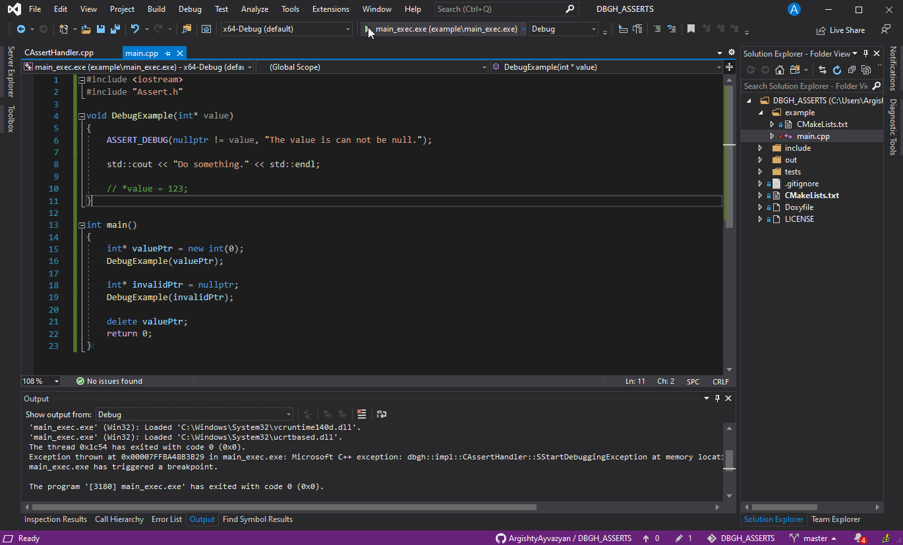

# DBGH_ASSERTS

## An assertion library for C++

The assert statement exists in almost every programming language. It helps detect problems early in your program, where the cause is clear, rather than later as a side-effect of some other operation.

The C ++ standard also has **assert**, but they are very simple. The **DBGH_ASSERTS** is a flexible and extensible assertion library for C++ without dependencies on other libraries. That contains some types of assertions.

## Demo

```cpp

#include <iostream>
#include "DBGHAssert.h"

void DebugExample(int* value)
{
    ASSERT_DEBUG(nullptr != value, "The value is can not be null.");

    std::cout << "Do something." << std::endl;

    // *value = 123;
}

int main()
{
    int* valuePtr = new int(0);
    DebugExample(valuePtr);

    int* invalidPtr = nullptr;
    DebugExample(invalidPtr);

    delete valuePtr;
    return 0;
}

```



## This library defines some types of asserts.

### ASSERT_DEBUG

Defined in header "DBGHAssert.h"

If the argument expression of this macro with functional form compares equal to 0 (i.e., the expression is false),
this causes an assertion failure that by default prints the assertion information to ```std::cerr``` and prompt the user
for action.
    There are available this actions:

* (I/i) Ignore this assertion and continue execution.
* (F/f) Ignore this assertion forever and continue execution.
* (D/d) Break into the debugger if that attached otherwise behavior undefined.
* (T/t) Throw dbgh::CAssertException exception.
* (B/b) Calls Terminate in **dbgh::CHandlerExecutor**. By default, call Terminate prints the assertion information to ```std::cerr``` and call ```std::terminate```.

#### The use example

```cpp
ASSERT_DEBUG(vec.size() < 7, "The vector size always less than 7.");
```

#### Details

Prints information about assertion, the message contains:

* Assertion type - DEBUG
* Uncaught exc - The number of uncaught exceptions.
* Filename - where the assertion is failed.
* Function name - where the assertion is failed.
* Expression - condition for the assertion that is failed.
* Message - \_message\_ string passed to the assertion.

#### Note

To change the assertion behavior, override the methods in the **dbgh::CHandlerExecutor** class and set the new version to **dbgh::CAssertConfig**, using the method **dbgh::CAssertConfig::SetExecutor** for that. For more information, see the documentation for class **dbgh::CHandlerExecutor**.
The example below:

```cpp
class NewExecutor : public dbgh::CHandlerExecutor { ... };
dbgh::CAssertConfig::Get().SetExecutor(std::make_unique<NewExecutor>());
```

#### Params

**\_expression\_**  Expression to be evaluated. If this expression evaluates to false, this causes an assertion failure.

**\_message\_**     The string that will appear as runtime error if the **\_expression\_** is false.

### ASSERT_WARNING

Defined in header "DBGHAssert.h"

If the argument expression of this macro with functional form compares equal to 0 (i.e., the expression is false), this causes an assertion failure that calls **HandleWarning** in **dbgh::CHandlerExecutor** By default, **HandleWarning** prints the assertion information to ```std::cerr```.

#### The use example:

```cpp
ASSERT_WARNING(vec.size() < 7, "The vector size always less than 7.");
```

#### Details

Prints information about assertion, the message contains:

* Assertion type - WARNING
* Uncaught exc - The number of uncaught exceptions.
* Filename - where the assertion is failed.
* Function name - where the assertion is failed.
* Expression - condition for the assertion that is failed.
* Message - \_message\_ string passed to the assertion.

#### Note

To change the assertion behavior, override the methods in the **dbgh::CHandlerExecutor** class and set the new version to **dbgh::CAssertConfig**, using the method **dbgh::CAssertConfig::SetExecutor** for that. For more information, see the documentation for class **dbgh::CHandlerExecutor**.
The example below:

```cpp
class NewExecutor : public dbgh::CHandlerExecutor { ... };
dbgh::CAssertConfig::Get().SetExecutor(std::make_unique<NewExecutor>());
```

#### Params

**\_expression\_**  Expression to be evaluated. If this expression evaluates to false, this causes an assertion failure.

**\_message\_**     The string that will appear as runtime error if the **\_expression\_** is false.

### ASSERT_ERROR

Defined in header "DBGHAssert.h"

If the argument expression of this macro with functional form compares equal to 0 (i.e., the expression is false), this causes an assertion failure that calls **HandleError** in **dbgh::CHandlerExecutor** By default, **HandleError** prints the assertion information to ```std::cerr``` and throws **dbgh::CAssertException**.

#### The use example

```cpp
ASSERT_ERROR(vec.size() < 7, "The vector size always less than 7.");
```

#### Details

Prints information about assertion, the message contains:

* Assertion type - ERROR
* Uncaught exc - The number of uncaught exceptions.
* Filename - where the assertion is failed.
* Function name - where the assertion is failed.
* Expression - condition for the assertion that is failed.
* Message - \_message\_ string passed to the assertion.

#### Note

To change the assertion behavior, override the methods in the **dbgh::CHandlerExecutor** class and set the new version to **dbgh::CAssertConfig**, using the method **dbgh::CAssertConfig::SetExecutor** for that. For more information, see the documentation for class **dbgh::CHandlerExecutor**.
The example below:

```cpp
class NewExecutor : public dbgh::CHandlerExecutor { ... };
dbgh::CAssertConfig::Get().SetExecutor(std::make_unique<NewExecutor>());
```

#### Params

**\_expression\_**  Expression to be evaluated. If this expression evaluates to false, this causes an assertion failure.

**\_message\_**     The string that will appear as runtime error if the **\_expression\_** is false.

### ASSERT_FATAL

Defined in header "DBGHAssert.h"

If the argument expression of this macro with functional form compares equal to 0 (i.e., the expression is false), this causes an assertion failure that calls Terminate in **dbgh::CHandlerExecutor**. By default, **Terminate** prints the assertion information to ```std::cerr``` and call ```std::terminate```.

#### The use example

```cpp
ASSERT_FATAL(vec.size() < 7, "The vector size always less than 7.");
```

#### Details
Prints information about assertion, the message contains:

* Assertion type - FATAL
* Uncaught exc - The number of uncaught exceptions.
* Filename - where the assertion is failed.
* Function name - where the assertion is failed.
* Expression - condition for the assertion that is failed.
* Message - \_message\_ string passed to the assertion.

#### Note
To change the assertion behavior, override the methods in the **dbgh::CHandlerExecutor** class and set the new version to **dbgh::CAssertConfig**, using the method **dbgh::CAssertConfig::SetExecutor** for that. For more information, see the documentation for class **dbgh::CHandlerExecutor**.
The example below:

```cpp
class NewExecutor : public dbgh::CHandlerExecutor { ... };
dbgh::CAssertConfig::Get().SetExecutor(std::make_unique<NewExecutor>());
```

#### Params

**\_expression\_**  Expression to be evaluated. If this expression evaluates to false, this causes an assertion failure.

**\_message\_**     The string that will appear as runtime error if the **\_expression\_** is false.

### Debug mode.

In a debug mode all asserts convert to ASSERT_DEBUG.

To enable debug mode use the CMake parameter -DDEBUG_MODE=ON
```bash
cmake -DDEBUG_MODE=ON ..
```

## API for configure assertions.

### Class dbgh::CAssertConfig

Defined in header "DBGHAssert.h"

This singlton class describes an assert configuration.
The CAssertConfig class holds the configuration and state of an Assertions. Allows you to enable or disable specific types of Assertions.

Enuble assert:

```cpp
dbgh::CAssertConfig::Get().EnableAsserts(dbgh::EAssertLevel::Fatal);
```

Disable assert:

```cpp
dbgh::CAssertConfig::Get().DisableAsserts(dbgh::EAssertLevel::Debug);
```

Allows to set of a new executor which defines assertions behavior.

Example:

```cpp
class NewExecutor : public dbgh::CHandlerExecutor { ... };
dbgh::CAssertConfig::Get().SetExecutor(std::make_unique<NewExecutor>());
```

### Class dbgh::CHandlerExecutor

This class describes behaving for assertions.

Executor defines the behavior of the assertion, if you need to change their behavior or add new features, you need to create a class that will inherit from **dbgh::CHandlerExecutor** and override the virtual functions that are responsible for the behavior and set a new executor in **dbgh::CAssertConfig**.

For example, you can add a stack trace, add a log file, notify other processes, and more:

```cpp
class NewExecutor : public dbgh::CHandlerExecutor
{
public:

    [[noreturn]] void Terminate(std::string_view message) override
    {
        // Send error code to the main process.
        boost::interprocess::managed_shared_memory managed_shm { open_or_create, "shm", 1024 };
        int *i = managed_shm.find_or_construct<int>("errorCode")();
        boost::interprocess::interprocess_mutex *mtx = managed_shm.find_or_construct<boost::interprocess::interprocess_mutex>("mtx")();
        mtx->lock();
        *i = 11;
        mtx->unlock();

        std::terminate();
    }

    [[noreturn]] void HandleError(std::string_view message, const dbgh::CAssertException& exception) override
    {
        // Add information of stack trace in the log for ASSERT_ERROR.
        std::stringstream ss;
        ss << boost::stacktrace::stacktrace() << std::endl;
        ss << message << std::endl;
        CHandlerExecutor::HandleError(ss.str(), exception);
    }

    void Logs(std::string_view message) override
    {
        // Add a file for logging.
        std::fstream { "asserts.log", std::ios_base::app } << message << std::endl;
        std::cerr << message << std::endl;
    }
};


int main()
{
    dbgh::CAssertConfig::Get().SetExecutor(std::make_unique<NewExecutor>());

    ASSERT_ERROR(2 * 2 == 4, "PASS");

    return 0;
}

```

## Message formatting

The first argument std::string_view representing the format string. The format string consists of
   * ordinary characters (except { and }), which are copied unchanged to the output,
   * escape sequences {{ and }}, which are replaced with { and } respectively in the output, and
   * replacement fields.

Each replacement field has the following format:
   * introductory { character;
   * (optional) arg-id, a non-negative number;
   * (optional) a colon (:) followed by a format specification;
   * final } character.

arg-id specifies the index of the argument in args whose value is to be used for formatting;
f arg-id is omitted, the arguments are used in order. The arg-ids in a format string must all be
resent or all be omitted. Mixing manual and automatic indexing is an error.

### example

```cpp
ASSERT_ERROR(vec.size() < vecSizeThreshold>, "The vector size always less than {}, the current size is: {}.", vecSizeThreshold, vec.size());
ASSERT_ERROR(vec.size() < vecSizeThreshold>, "The vector size always less than {1}, the current size is: {0}.", vec.size(), vecSizeThreshold);
```

## Building DBGH_ASSERTS

### Release build:

```bash
mkdir build
cd ./build
cmake ..
make -j <job count>
```

### Debug build:

```bash
mkdir debug
cd ./debug
cmake -DCMAKE_BUILD_TYPE=Debug ..
make -j <job count>
```

### Build example and unit tests.
```bash
mkdir build
cd ./build
cmake -DDBGH_ASSERTS_BUILD_EXAMPLE=ON -DDBGH_ASSERTS_BUILD_UNIT_TESTS=ON ..
make -j <job count>
```

## License
This project is licensed under the GNU General Public License v3.0 - see the [LICENSE](LICENSE) file for details
